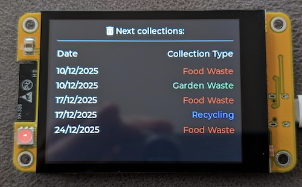

# Bin collections on a cheap yellow display 

This project is for the JC2432W328 variant of Cheap Yellow Display (which is £14.99 on aliexpress). It shows upcoming bin collections from a txt file fetched from a URL on my internal network. It's architected in this way to reduce the complexity on the ESP32 - scraping the data from the mid-sussex district website and formatting it into the text file is done by a python script which runs once a week by a Linux computer on my network.

Note: I would not recommend the JC2432W328 CYD board. The documentation is terrible and the code examples don't work. I eventually [found some code on github](https://github.com/pay191/DIY_Malls-JC2432W328C_Tests) that helped get me going. 



## Features

- **WiFi Connectivity**: Connects to WiFi networks and saves credentials for automatic reconnection
- **Data Fetching**: Retrieves collection schedules from a local web server
- **Automatic Refresh**: Updates data every 12 hours automatically
- **Color-Coded Display**: Different collection types shown in different colors:
  - Food Waste: Red
  - Garden Waste: Light Green  
  - Recycling: Blue
  - General Waste: White (default)
- **Persistent Storage**: WiFi credentials saved using ESP32 Preferences
- **Touch Support**: CST820 capacitive touchscreen driver (touch functionality available)

## Hardware Requirements

- [JC2432W328 Cheap Yellow Display](https://www.aliexpress.com/item/1005007865384573.html?spm=a2g0o.order_list.order_list_main.10.4ed318022S6s82)
- Power supply (5V recommended)

### Pin Connections

| Component | ESP32 Pin | Description |
|-----------|-----------|-------------|
| ST7789 SCLK | GPIO 14 | SPI clock |
| ST7789 MOSI | GPIO 13 | SPI data |
| ST7789 DC | GPIO 2 | Data/Command |
| ST7789 CS | GPIO 15 | Chip select |
| CST820 SDA | GPIO 21 | I2C data (touch) |
| CST820 SCL | GPIO 22 | I2C clock (touch) |
| CST820 RST | GPIO 18 | Touch reset |
| CST820 IRQ | GPIO 19 | Touch interrupt |
| Display Backlight | GPIO 27 | Display enable |

## Software Requirements

- Arduino IDE or PlatformIO
- ESP32 board support package
- Required libraries:
  - LovyanGFX
  - LittleVGL (lvgl)
  - WiFi
  - HTTPClient
  - Preferences

## Data Format

The project expects a text file served at the configured URL, like the included collections.txt

## Configuration

### LittleVGL Configuration (lv_conf.h)
Optimized for minimal memory usage (32KB heap):
- Only essential widgets enabled (Label, Display)
- Performance monitoring disabled
- Logging disabled
- 16-bit color depth

### Display Settings
- Resolution: 320x240 (rotated)
- SPI frequency: 27MHz write, 16MHz read
- Display buffer: 240x10 pixels (partial rendering)

## Usage

1. **First Boot**: The device will attempt to connect to the configured WiFi network
2. **Data Display**: Once connected, it fetches and displays the collection schedule
3. **Automatic Updates**: Data refreshes every 12 hours
4. **WiFi Reconnection**: If WiFi drops, it automatically attempts to reconnect

### Manual Refresh
The device checks the refresh condition every 30 seconds (to avoid excessive CPU usage) but only actually fetches new data when 12 hours have passed since the last successful fetch. To force a refresh:
1. Power cycle the device
2. Or wait for the 12-hour automatic refresh

## Memory Optimization

This project is optimized for ESP32 memory constraints but still uses 99% of the ESP32 memory, therefore isn't very extendable without refactoring or removing bits.
- Limited LittleVGL features enabled
- Small display buffer (partial rendering)
- No unnecessary widgets or animations
- String handling optimized to avoid fragmentation

Enable Serial monitor at 115200 baud for debugging:
- Connection status
- HTTP request results
- Data parsing information
- Refresh notifications

## Customization

### Changing Colors
Edit the `showCollectionsTable()` function in the main sketch:
```cpp
if (strstr(collections[i].type, "Food Waste") != NULL) {
  type_color = lv_color_hex(0xFF0000); // red
} else if (strstr(collections[i].type, "Garden Waste") != NULL) {
  type_color = lv_color_hex(0x90EE90); // light green
}
```

### Changing Refresh Interval
Modify `REFRESH_INTERVAL` in the main sketch:
```cpp
const unsigned long REFRESH_INTERVAL = 12 * 3600 * 1000UL; // 12 hours in milliseconds
```

## License

This project is open source. Feel free to modify and distribute.
